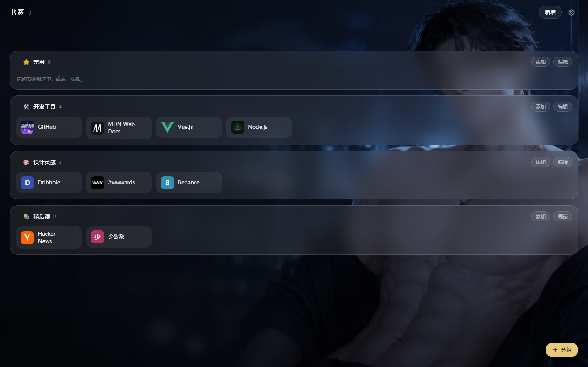
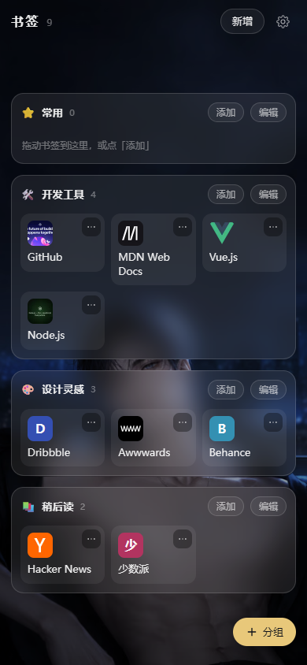

# 书签

自己用的单密码书签导航站。一屏分组网格、贴网址自动补全标题与图标、图标缓存在本地、
壁纸可切换。**一个 Node 进程同时托管前端与 API**，数据就是一个 `./data` 目录，
`docker compose up` 即用。



<p align="center">
  
</p>

## 三步部署

```bash
git clone <这个仓库> bookmark-nav && cd bookmark-nav
cp .env.example .env      # 改掉 PASSWORD 和 SESSION_SECRET
docker compose up -d --build
```

打开 `http://localhost:3000`，输入 `.env` 里设置的密码。首次启动会自动建好
「常用」分组、生成收藏按钮令牌，并把 4 组内置壁纸写进库。

`SESSION_SECRET` 用 `openssl rand -hex 32` 生成，长度不足 32 字节会拒绝启动。

### 环境变量

| 变量 | 必填 | 说明 |
| --- | --- | --- |
| `PASSWORD` | 是 | 站点访问密码。缺失或全空白则启动失败 |
| `SESSION_SECRET` | 是 | 会话 Cookie 的 HMAC 密钥，至少 32 字节 |
| `COOKIE_SECURE` | 否 | 会话 Cookie 是否带 `Secure`。留空按 `NODE_ENV` 推导 |
| `PORT` | 否 | 宿主机映射端口，默认 3000（容器内固定 3000） |
| `DATA_DIR` | 否 | 数据目录，compose 里固定 `/app/data` |

> **内网纯 HTTP 访问（比如 `http://192.168.1.10:3000`）必须在 `.env` 里加
> `COOKIE_SECURE=false`。** 容器里是 `NODE_ENV=production`，Secure 默认开启，
> 而带 Secure 的 Cookie 在 http 下浏览器不会回传——症状是「密码明明是对的，
> 却一直跳回登录页」。

## 备份与恢复

**备份 `./data` 这一个目录就够了**，SQLite、图标缓存、上传的壁纸都在里面。

```bash
tar czf nav-backup-$(date +%F).tar.gz data/
```

恢复就是把 `data/` 放回去再启动。SQLite 开着 WAL，热备份建议先停容器。

## 添加书签的三种方式

1. **站内新增**：右上「新增」，或者分组面板上的「添加」。贴上网址会自动抓取标题、
   描述和图标候选；抓不到也能手填保存。
2. **收藏按钮**：设置 → 收藏按钮，把那个按钮拖到浏览器书签栏。之后在任意网页点它，
   就会跳回本站并预填当前页的网址与标题。
3. **导入**：设置 → 导入，支持两种来源（见下）。

### 导入说明

- **浏览器书签 HTML**：Chrome / Edge / Firefox 导出的 `.html`。最浅那一层文件夹变成
  分组，更深的文件夹合并进最近的顶层分组；`javascript:` 这类占位书签会跳过。
- **旧站 JSON**：见下面的迁移步骤。
- 两种导入都会**按网址去重**：库里已有的、以及同一次导入里重复的都会跳过。
  某个文件夹里的书签全被去重掉时，不会留下空分组。

## 从旧站「极光导航」迁移

1. **下线旧站之前**，浏览器访问一次旧站的 `/api/projects`，把返回的 JSON 存成文件。
   返回体是 `{"items": [...]}`，本站也接受只把数组截出来存的形式。
2. 新站 设置 → 导入 → 「旧站导出的 JSON」→ 选那个文件。
3. 映射关系：`category` → 分组名、`name` → 标题、`description` → 描述。
   旧站的点击计数、公开/私有、图标等字段按重构决定丢弃。

## 本地开发

```bash
npm install
npm run dev            # 并行起 vite(5173) 与后端(3000)，/api /icons /wallpapers /add 走代理
```

```bash
npm run typecheck      # 前后端两份 tsconfig
npm test               # 后端与前端纯函数的 node:test
npm run build          # typecheck + vite build + esbuild 打包 server
npm run build:wallpapers  # 从 assets/wallpapers-src 重新生成内置壁纸（需要源图）
```

端到端测试跑在一个**已经起好**的实例上：

```bash
npm run build
PASSWORD=... SESSION_SECRET=... PORT=3500 node server/index.ts &
NAV_BASE_URL=http://127.0.0.1:3500 NAV_PASSWORD=... npx playwright test
```

`NAV_BROWSER_CHANNEL=chrome` 可以改用系统 Chrome，省掉一次浏览器下载。

## 设计与取舍

- **不引 UI 库 / 拖拽库 / 路由库 / 动画库**：需求面窄，原生够用，首屏 JS gzip
  压在 50KB 以内。
- **图标一律本地缓存**：新增时先回响应、再异步下载转 64px WebP。首屏零外链，
  也避免别人的站点挂掉时满屏裂图。抓不到的站点显示「首字 + 域名哈希色块」。
- **壁纸档位宽度随数据走**：生图服务把输出封顶在约 157 万像素，所以档位按实际尺寸
  命名而不是写死 2560/1280，前端从接口拿 `widths` 拼 `srcset`。
- **`node:sqlite` 而非 better-sqlite3**：免原生编译，镜像更简单；代价是要求 Node ≥ 24。
- **缩略图以外不请求外网**：导入时的图标抓取是后台任务，并发限制在 4。

### 已知限制

- 只提供 BMP 型 `.ico` 的站点（比如百度）拿不到图标——sharp 解不了 ICO 容器，
  这类站点会一直显示首字色块。其余站点会优先用页面声明的
  `apple-touch-icon` 等 PNG 候选。
- 移动端只读为主：可以增删改，但不支持拖拽排序。
- 壁纸切换后同一主题的横竖两版会自动按屏幕方向选用，不需要手动挑方向。

## 许可

自用项目，未附带许可证。
